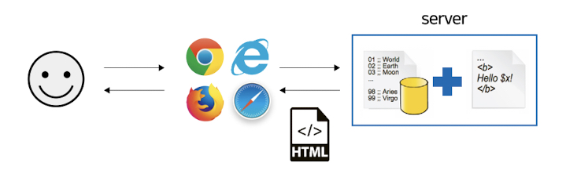
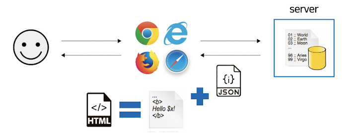

# CHAPTER04. 머스테치로 화면 구성하기

## 4.1 서버 템플릿 엔진과 머스테치 소개

- 템플릿 엔진

  - 지정된 템플릿 양식과 데이터가 합쳐져 HTML 문서를 출력하는 소프트 웨어.

  - 서버 템플릿 엔진

    - 서버에서 구동됨.

      

  - 클라이언트 템플릿 엔진

    - 


### 머스테치(mustache)란

- [머스테치](http://mustache.github.io/) 는 수많은 언어를 지원하는 가장 심플한 템플릿 엔진.

  - 루비, 자바스크립트, 파이썬, PHP, 자바, Go, ASP 등 현존하는 대부분 언어 지원.
  - 자바에서 사용될 때는 서버 템플릿 엔진으로, 자바스크립트에서 아용될 때는 클라이언트 템플릿 엔으로 모두 사용 가능.

- 장점

  - 문법이 다른 템플릿 엔진보다 심플함.
  - 로직 코드를 사용할  수 없어 View의 역확과 서버의 역할이 명확하게 분리됨.
  - Mustache.js와 Mustache.java 2가지가 다 있어, 하나의 문법으로 클라이언트/서버 템플릿을 모두 사용 가능함.

  > 자바 진영의 다양한 서버 템플릿 엔진 
  >
  > - JSP, Velocity, Freemarker, Thymeleaf 등.
  >
  >   > 필자가 생각하는 템플릿 엔진 단점
  >   >
  >   > - JSP, Velocity : 스프링 부트에서는 권장하지 않는 템플릿 엔진.
  >   > - Freemarker 
  >   >   - 템플릿 엔진으로는 너무 과하게 많은 기능을 지원.
  >   >   - 높은 자유도로 인해 숙련도가 낮을수록 Freemarker 안에 비즈니스 로직이 추가될 확률이 높음.
  >   > - Thymeleaf 
  >   >   - 스프링 진영에서 적극적으로 밀고있지만 문법이 어려움.


### 머스테치 플러그인 설치

- 인텔리제이 Marketplace에서 'mustache'를 검색해서 해당 프로그인을 설치하면 됨.

  


----

## 4.2 기본 페이지 만들기

- build.gradle 에 머스테치 스타터 의존성 등록.

  ```properties
  dependencies {
      ...
      compile('org.springframework.boot:spring-boot-starter-mustache:')
      ...
  }
  ```

- Controller

  - IndexController

    ```java
    package com.spring.book.springboot.web;
    
    import org.springframework.stereotype.Controller;
    import org.springframework.web.bind.annotation.GetMapping;
    
    @Controller
    public class IndexController {
    
        @GetMapping("/")
        public String index(){
            return "index";
        }
    }
    
    
    ```

    > 머스테치의 파일 위치 
    >
    > - 기본 : src/main/resources/templates
    >
    > - 머스테치 스타터 덕분에 컨트롤러에서 문자열을 반환할때 앞의 경로와 뒤의 파일확장자는 자동으로 지정됨.
    >   - 앞의 경로 : src/main/resources/templates
    >   - 뒤의 확장자 : mustache

- View

  - index.mustache

    ```html
    <!DOCTYPE HTML>
    <html>
    <head>
        <title>스프링부트 웹서비스</title>
        <meta http-equiv="Content-Type" content="text/html; charset=UTF-8" />
    </head>
    <body>
    <h1>스프링부트로 시작하는 웹 서비스</h1>
    </body>
    </html>
    ```

    

- 테스트 코드 작성 

  - indexControllerTest

    ```java
    package com.spring.book.springboot.web;
    import org.junit.Test;
    import org.junit.runner.RunWith;
    import org.springframework.beans.factory.annotation.Autowired;
    import org.springframework.boot.test.context.SpringBootTest;
    import org.springframework.boot.test.web.client.TestRestTemplate;
    import org.springframework.test.context.junit4.SpringRunner;
    
    import static org.assertj.core.api.Assertions.assertThat;
    import static org.springframework.boot.test.context.SpringBootTest.WebEnvironment.RANDOM_PORT;
    
    @RunWith(SpringRunner.class)
    @SpringBootTest(webEnvironment = RANDOM_PORT)
    public class IndexControllerTest {
    
        @Autowired
        private TestRestTemplate restTemplate;
    
        @Test
        public void 메인페이지_로딩() {
            //when
            String body = this.restTemplate.getForObject("/", String.class);
    
            //then
            assertThat(body).contains("스프링부트로 시작하는 웹 서비스");
        }
    }
    
    ```

    

## 4.3 게시글 등록 화면 만들기


> 프론트엔드 라이브러리를 사용할 수 있는 방법
>
> 1. 외부 CDN 사용.
> 2. 직접 라이브러리를 받아서 사용.

- 레이아웃

  - 부트스트랩을 이용한 화면 구현

     → 2개의 라이브러리 부트스트랩과 제이쿼리를 index.mustache에 레이아웃 방식으로 추가

    - 머스테치 화면 어디서나 필요하므로 레이아웃 파일들을 만들어 추가.

      > 레이아웃 방식 ? 공통 영역을 별도의 파일로 분리하여 필요한 곳에서 가져다 쓰는 방식.

    - 머스테치 레이아웃 구조 : src/main/resources/templates/layout

      - header.mustache

        - CSS 위치함.

          - css는 화면을 그리는 역할이므로 head에 불러오는 것이 좋음. 

            그렇지 않으면 css가 적용되지 않은 깨진 화면을 사용자가 볼 수 있기 때문.

        ```html
        <!DOCTYPE HTML>
        <html>
        <head>
            <title>스프링부트 웹서비스</title>
            <meta http-equiv="Content-Type" content="text/html; charset=UTF-8" />
        
            <link rel="stylesheet" href="https://stackpath.bootstrapcdn.com/bootstrap/4.3.1/css/bootstrap.min.css">
        </head>
        <body>
        ```

      - footer.mustache

        - JS 위치함.

          - js의 용량이 크면 클수록 body부분의 실행이 늦어지기 때문에 js는 body하단에 두어 화면이 다 그려진 뒤에 호출하는 것이 좋음.
            - 왜? HTML은 위에서부터 코드가 실행되기 때문에 head가 다 실행되고서야 body가 실행됨. 즉, head가 다 불러지 않으면 사용자 쪽에서 백지 화면만 노출됨.

        - jquery 및 bootstrap 위치함.

          - jquery를 bootstrap보다 먼저 호출되도록 작성.

            - 왜? bootstrap.js가 제이쿼리에 의존함.

               →bootstrap.js의 경우 제이쿼리가 꼭 있어야 함.

        ```html
        <script src="https://code.jquery.com/jquery-3.3.1.min.js"></script>
        <script src="https://stackpath.bootstrapcdn.com/bootstrap/4.3.1/js/bootstrap.min.js"></script>
        
        </body>
        </html>
        ```

- 메인 페이지 : index.mustache

  ```html
  {{>layout/header}}
  <h1>스프링 부트로 시작하는 웹 서비스 Ver.2</h1>
  <div class="col-md-12">
      <div class="row">
          <di class="col-md-6">
              <a href="/posts/save" role="button" class="btn btn-primary">글등록</a>
          </di>
      </div>
  </div>
  {{>layout/footer}}
  ```

  - {{>}} : 현재 머스테치 파일을 기준으로 다른 파일을 가져옴.

  - 등록버튼은 API를 호출하는 JS가 없기 때문에 기능이 없다. 

    

- API를 호출하는 JS

  - index.js 생성

    - 위치 : /src/main/resources/static/js/app

    - footer.mustache에 index.j 호출코드 추가

      ```html
      ...
      <!--index.js 추가-->
      <script src="/js/app/index.js"></script>
      ...
      ```

      - index.js 호출코드를 보면 절대경로(/)로 바로 싲가함.

        - 정적파일의 절대경로 

          - src/main/resources/static에 위치한 정적 파일들은 URL에서 /로 설정됨.

            > 정적파일? 자바스크립트, CSS, 이미지 등 .

    - 소스

      ```javascript
      var main = {
          init : function (){
              var _this = this;
              // $("#btn-save").on("click",function(){
              //     _this.save();
              // });
              $("#btn-save").click(function () {
                 _this.save();
              });
          },
          save : function () {
              var data = {
                  title : $("#title").val(),
                  author : $("#author").val(),
                  content : $("#content").val()
              }
      
              $.ajax({
                  type : "POST",
                  url : "/api/v1/posts",
                  dataType :"json",
                  data : data
              }).done(function () {
                  alert("글이 등록되었습니다.");
                  window.location.href = "/";
              }).fail(function (error) {
                  alert(JSON.stringify(error));
              });
          }
      }
      ```

      - 첫 문장에 var main = {} 라는 코드를 선언한 이유
        - 다른 js에 같은 이름의 funcion이 있다면 브라우저의 스코프(scope)는 공용 공간으로 쓰이기 때문에 나중에 로딩된 init, save가 먼저 로딩된 js의 function을 덮어쓰게 됨.
          - 여러 사람이 참여하는 프로젝트에서는 중복된 함수(function)이름을 자주 발생할 수 있음.
        - 이런문제를 피하기 위해 index.js만의 유효범위(scope)를 만들어 사용.
          - 방법 : var  main이란 객체를 만들어 해당 객체에서 필요한 모든 function을 선언하는 것.
            - 이렇게 하면 main 객체 안에서만 function이 유효하기 때문에 다른 Js와 겹칠 위험이 사라짐.


## 4.4 전체 조회 화면 만들기


- Repository 

  - postsRepository

    ```java
    ...
      
    public interface PostsRepository extends JpaRepository<Posts, Long> { 
      
      @Query("SELECT p FROM Posts p ORDER BY p.id DESC ")    
      List<Posts> findAllDesc();
    }
    ```

    - SpringDataJpa에서 제공하지 않는 메소드는 위처럼 쿼리로 작성해도 된다. 

    - @Query을 사용함.

      > 조회용 프레임워크 : Querydsl, jooq, MyBatis 등
      >
      > > Querydsl을 추천하는 이유
      > >
      > > 1. 타입 안정성이 보장됨.
      > >    - 단순한 문자열로 쿼리를 생성하는 것이 아니라, 메소드를 기반으로 쿼리를 생성하기 때문에 오타나 존재하지 않는 컬럼명을 명시할 경우 IDE에서 자동으로 검출됨.
      > >      - Jooq 지원 O, MyBatis 지원 X
      > > 2. 국내 많은 회사에서 사용 중.
      > >    - JPA를 적극적으로 사용하는 회사에서는 Querydsl 적극 사용중.
      > > 3. 레퍼런스가 많음.

- Service

  - PostsService

    ```java
    public class PostsService {
        private final PostsRepository postsRepository;
    
        ...
    
        @Transactional(readOnly = true)
        public List<PostsListResponseDto> findAllDesc(){
            return postsRepository.findAllDesc().stream()
                    .map(PostsListResponseDto::new)
                    .collect(Collectors.toList());
        }
    }
    
    ```

    - 메소드 설명

      - postsRepository 결과로 넘어온 Posts의 Stream을 map을 통해 PostsListResponseDto 변환 → Lists로 변환하는 메소드.

    - @Transactional(readOnly = true)

      - (readOnly = true)  : 등록, 수정, 삭제 기능이 전혀 없는 서비스 메소드에서 사용 추천.
        - 트랜잭션 범위는 유지하되, 조회기능만 남겨둠 → 조회속도 개선

    -  .map(PostsListResponseDto::new)

      - 다음과 같음

        ```java
        .map(posts -> new PostsListResponseDto(posts))
        ```

- Dto

  - PostsListResponseDto

    ```java
    package com.spring.book.springboot.web.dto;
    
    import com.spring.book.springboot.domain.posts.Posts;
    import lombok.Getter;
    
    import java.time.LocalDateTime;
    
    @Getter
    public class PostsListResponseDto {
        private Long id;
        private String title;
        private String author;
        private LocalDateTime modifiedDate;
    
        public PostsListResponseDto(Posts entity){
            this.id = entity.getId();
            this.title = entity.getTitle();
            this.author = entity.getAuthor();
            this.modifiedDate = entity.getModifiedDate();
        }
    }
    
    ```

    

- Controller

  - IndexController

    ```java
    ...
    
    @RequiredArgsConstructor
    @Controller
    public class IndexController {
    
        private final PostsService postsService;
    
        @GetMapping("/")
        public String index(Model model){
            model.addAttribute("posts", postsService.findAllDesc());
            return "index";
        }
    
        ...
    } 
    
    ```

    - Model
      - 서버 템플릿 엔진에서 사용할 수 있는 객체를 저장할 수 있음.
      - 여기서는 postsService.findAllDesc()로 가져온 결과를 posts로 index.mustache에 전달.

- View

  - index.mustache

    - 전체조회를 위한 index.mustache의 UI변경

    ```html
    {{>layout/header}}
    <h1>스프링 부트로 시작하는 웹 서비스 Ver.2</h1>
    <div class="col-md-12">
        <div class="row">
            <di class="col-md-6">
                <a href="/posts/save" role="button" class="btn btn-primary">글등록</a>
            </di>
        </div>
        <br>
        <!-- 목록 출력 영역 -->
        <table class="table table-horizontal table-bordered">
            <thead class="thead-strong">
                <tr>
                    <th>게시글번호</th>
                    <th>제목</th>
                    <th>작성자</th>
                    <th>최종수정일</th>
                </tr>
            </thead>
            <tbody id="tbody">
            {{#posts}}
                <tr>
                    <td>{{id}}</td>
                    <td>{{title}}</td>
                    <td>{{author}}</td>
                    <td>{{modifiedDate}}</td>
                </tr>
            {{/posts}}
            </tbody>
        </table>
    </div>
    {{>layout/footer}}
    ```

    - {{#posts}}
      - posts라는 List 순회.
      - Java의 for문과 동일.
    - {{변수명}} 
      - Lists에서 뽑아낸 객체의 필드 사용.


## 4.5 게시글 수정,삭제 화면 만들기

### 게시글 수정

- 수정 API

  - Service

    - PostsApiService

      ```java
       @Transactional
          public Long update(Long id, PostsUpdateRequestDto requestDto){
              Posts posts = postsRepository.findById(id)
                      .orElseThrow(() -> new IllegalArgumentException("해당 게시글이 없습니다. id =" + id));
              posts.update(requestDto.getTitle(), requestDto.getContent());
              return id;
          }
      ```

      

  - Controller

    - PostsApiController : 수정기능

      ```java
      ...
        
      @RequiredArgsConstructor
      @RestController
      public class PostsApiController {
          private final PostsService postsService;
      
          ...
      
          @PutMapping("/api/v1/posts/{id}")
          public Long update(@PathVariable Long id, @RequestBody PostsUpdateRequestDto requestDto){
              return postsService.update(id, requestDto);
          }
      
         ...
      }
      
      ```

- 수정화면 

  - posts-update.mustache 

    ```html
    {{>layout/header}}
    
    <h1>게시글 수정</h1>
    <div class="col-md-12">
        <div class="col-md-4">
            <form>
                <div class="form-group">
                    <label for="id">글번호</label>
                    <input type="text" class="form-control" id="id" value="" readonly>
                </div>
                <div class="form-group">
                    <label for="title">제목</label>
                    <input type="text" class="form-control" id="title" value="">
                </div>
                <div class="form-group">
                    <label for="author">작성자</label>
                    <input type="text" class="form-control" id="author" value="" readonly>
                </div>
                <div class="form-group">
                    <label for="content">내용</label>
                    <textarea class="form-control" id="content"></textarea>
                </div>
            </form>
            <a href="/" role="button" class="btn btn-secondary">취소</a>
            <button type="button" class="btn btn-primary" id="btn-update">수정완료</button>
        </div>
    </div>
    
    {{>layout/footer}}
    ```

- 수정이벤트를 추가할 JS 코드 추가

  - index.js

    ```javascript
    var main = {
       init : function (){
            var _this = this;
    				...
            $("#btn-update").click(function () {
                _this.update();
            });
        },
        ...
        update : function (){
            var data = {
                title : $("#title").val(),
                content : $("#content").val()
            };
    
            var id = $("#id").val();
    
            $.ajax({
                type: 'PUT',
                url: '/api/v1/posts/' + id,
                dataType: 'json',
                contentType: "application/json; charset:utf-8",
                data: JSON.stringify(data)
            }).done(function(){
                alert('글이 수정되었습니다.');
                window.location.href = '/';
            }).fail(function (error) {
                alert(JSON.stringify(error));
            })
    
        }
    }
    main.init();
    ```

    > type 종류
    >
    > - 생성(Create) - POST
    > - 읽기(Read) - GET
    > - 수정(Update) - PUT
    > - 삭제(Delete) - DELETE

    

### 게시글 삭제

- 수정 화면에 삭제 버튼 추가

  - posts-update.mustache

    ```html
    ...
    <button type="button" class="btn btn-danger" id="btn-delete">삭제</button>
    ...
    ```

- 삭제 이벤트를 진행할 JS 코드 추가

  - index.js

    ```js
    var main = {
        init : function (){
            var _this = this;
          
    				...
            
            $("#btn-delete").click(function () {
                _this.delete();
            });
        },
      
        ...
      
        delete : function () {
            var id = $("#id").val();
            $.ajax({
                type:'DELETE',
                url:'/api/v1/posts/'+id,
                dataType:'json',
                contentType:"application/json; charset:utf-8"
            }).done(function () {
                alert('글이 삭제되었습니다.');
                window.location.href="/";
            }).fail(function (error) {
                alert(JSON.stringify(error));
            })
        }
    }
    main.init();
    ```

- 삭제 API

  - Service

    - PostsService

      ```java
      ...
        
      @RequiredArgsConstructor
      @Service
      public class PostsService {
          private final PostsRepository postsRepository;
        
      		...
            
          @Transactional
          public void delete(Long id){
              Posts posts = postsRepository.findById(id)
                      .orElseThrow(() -> new IllegalArgumentException("해당 게시글이 없습니다. id=" + id));
              postsRepository.delete(posts);
          }
      		
        	...
      }
      ```

  - Controller

    - PostsApiController

      ```java
      ...
      
      @RequiredArgsConstructor
      @RestController
      public class PostsApiController {
          ...
      
          @DeleteMapping("/api/v1/posts/{id}")
          public Long delete(@PathVariable Long id){
              postsService.delete(id);
              return id;
          }
          
      }
      
      ```

      