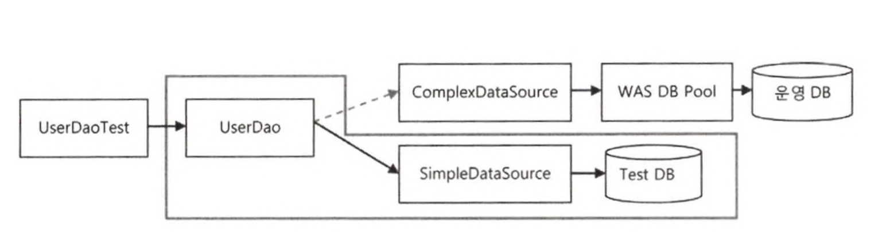

## 5.2 트랜잭션 서비스 추상화

> **트랜잭션**
>
> - 더 이상 나눌 수 없는 단위 작업.
> - 트랜잭션의 핵심 속성 : 원자성
>   - 작업을 쪼개서 작은 단위로 만들 수 없다.

------------

### 5.2.2 트랜잭션 경계설정

#### JDBC 트랜잭션의 트랜잭션 경계설정

- 모든 트랜잭션은 시작하는 지점과 끝나는 지점이 있다.

  - 시작하는 방법은 한 가지이지만 끝나는 방법은 두 가지다.
    - 끝나는 방법 
      1. 롤백 : 모든 작업을 무효화함.
      2. 커밋 : 모든 작업을 다 확정함.

- 트랜잭션 경계 : 애플리케이션 내에서 트랜잭션이 시작되고 끝나는 위치.

  - 복잡한 로직의 흐름 사이에서 정확하게 트랜잭션 경계를 설정하는 일은 매우 중요한 작업.
  - 트랜잭션의 경계설정
    - setAutoCommit(false)로 트랜잭션의 시작을 선언하고 commit() 또는 rollback()으로 트랜잭션을 종료하는 작업.
      - 트랜잭션의 경계는 하나의 Connection이 만들어지고 닫히는 범위 안에 존재한다. 

- 로컬 트랜잭션(local transaction) : 하나의 DB 커넥션 안에서 만들어지는 트랜잭션.

- 트랜잭션을 사용한 JDBC 코드

  ```java
  /* DB 커넥션[시작] */
  Connection c = dataSource.getConnection();
  
  /* 트랜잭션[시작]*/
  c.setAutoCommit(false); // 트랜잭션 시작
  try{
    /* -- 하나의 트랜잭션으로 묶인 단위작업 -- */
    PreparedStatement st1 = c.prepareStatement("update users ...");
    st1.executeUpdate();
    
    preparedStatement st2 = c.prepareStatement("delete users ...");
    st2.executeUpdate();
    /* ------------------------------ */
    
    c.commit(); // 트랜잭션 커밋
  }catch(Exception e){
    c. rollback();// 트랜잭션 롤백 
  /* 트랜잭션[종료]*/
  }
  c.close();
  /* DB 커넥션[종료]*/
  ```

  - JDBC의 트랜잭션
    - 하나의 Connection을 가져와 사용하다가 닫는 사이에서 일어난다.
      - 트랜잭션의 시작과 종료는 Connection 오브젝트를 통해 이루어지기 때문.

    - 트랜잭션의 시작 : 자동 커밋 옵션을 fasle로 만들어 주면 됨.
      - JDBC의 기본 커밋 설정 : DB 작업을 수행한 직후에 자동으로 커밋이 되도록 되어 있음.
        - 즉, 작업마다 커밋해서 트랜잭션을 끝내버리므로 여러 개의 DB작업을 모아서 트랜잭션을 만드는 기능이 꺼져 있다. 

    - 하나의 트랜잭션 : 트랜잭션이 한 번 시작되면 commit() 또는 rollback() 메소드가 호출될 때까지의 작업.
      - commit() 또는 rollback()이 호출되면 그에 따라 작업 결과가 DB에 반영되거나 취소되고 트랜잭션이 종료됨.
      - 일반적으로 작업중에 예외가 발생하면 트랜잭션을 롤백한다.
        - 예외가 발생했다는 건, 트랜잭션을 구성하는 데이터 엑세스 작업을 마무리할 수 없는 상황이거나 DB에 결과를 반영하면 안되는 이유가 생겼기 때문.


#### 비즈니스 로직 내의 트랜잭션 경계설정

- upgradeLevels의 트랜잭션 경계설정 구조

  ```java
  public void upgradLevels() throws Exception {
    (1) DB Connection 생성
  	(2) 트랜잭션 시작
      try{
        (3) DAO 메소드 호출
        (4) 트랜잭션 커밋
      }catch(Exception e){
        (5) 트랜잭션 롤백
          throws e;
      }finally{
        (6) DB Connection 종료
      }
  }
  ```

  

- Connection을 공유하도록 수정된 UserService 메소드

  - 어떻게 같은 트랜잭션 안에서 동작하게 할까?
    -  DB커넥션과 트랜잭션 관련 코드는 UserServiece에서 하지만, 순수한 데이터 엑세스 로직은 UserDao에 둬야함.
    -  트랜잭션을 담고 있는 Connceciont 공유
       - UserService에서 만든 Connection 오브젝트를 UserDao에서 사용하려면 DAO 메소드를 호출할 대마다 Connection 오브젝트를 파라미터로 전달해줘야 함.
       - 결국 아래와 같이 UserService의 메소드 사이에도 같은 Connection 오브젝트를 사용하도록 파라미터로 전달해줘야 함.
         - UserDao를 사용하는 것은 사용자별로 업그레이드 작업을 진행하는 upgrardeLevel() 메소드.

  


#### UserService 트랜잭션 경계설정의 문제점

1. DB 커넥션을 비롯한 리소스의 깔끔한 처리를 가능하게 했던 JdbcTemplate을 더 이상 활용할 수 없다.

   - 결국 JDBC API를 직접 사용하는 초기방식으로 돌아가야 한다.
   - try/catch/finally 블록은 이제 UserService 내에 존재하고, UserService의 코드는 JDBC 작업코드의 전형적인 문제점을 그대로 가질 수밖에 없다.

2. DAO의 메소드나 비즈니스 로직을 담고 있는 UserService의 메소드에 Connection 파라미터가 추가돼야 한다.

3. Connection 파라미터가 UserDao 인터페이스 메소드에 추가되면 UserDao는 더 이상 데이터 엑세스 기술에 독립적일 수가 없다.

4. DAO 메소드에 Connection 파라미터를 받게 하면 테스트 코드에도 영향을 미친다.

   - 지금까지 DB 커넥션은 전혀 신경 쓰지 않고 테스트에서 UserDao를 사용할 수 있었는데, 이제는 테스트 코드에서 직접 Connection 오브젝트를 일일이 만들어서 DAO 메소드를 호출하도록 모두 변경해야 함.

   

-------

### 5.2.3. 트랜잭션 동기화

#### Connection 파라미터 제거

- 독릭접인 **트랜잭션 동기화**(transaction synchroniaztion)방식.

  - Connection을 파라미터로 직접 전달하는 문제의 해결.

    - 트랜잭션 동기화

      - DAO가 사용하는 JdbcTemplate이 트랜잭션 동기화 방식을 이용하도록 하는 것.
      - 트랜잭션이 모두 종료되면, 그때는 동기화를 마치면 됨.

      

- 트랜잭션 동기화를 사용한 경우의 작업 흐름

  

  - (1) UserService는 Connection을 생성함.

  - (2) 이를 트랜잭션 동기화 저장소에 저장해두고 Connection의 setAutoCommit(false)를 호출해 트랜잭션을 시작시킨 후에 본격적으로 DAO의 기능을 이용하기 시작한다.

  - (3) 첫번째 update() 메소드가 호출되고, update() 메소드 내부에서 이용하는 JdbcTemplate 메소드에서는 가장 먼저

  - (4) 트랜잭션 동기화 저장소에 현재 시작된 트랜잭션을 가진 Connection 오브젝트가 존재하는지 확인한다.

  - (2) upgradeLevels() 메소드 시작 부분에서 저장해둔 Connection을 발견하고 이를 가져온다.

  - (5) Connection을 이용해 PreparedStatement를 만들어 수정 SQL을 실행한다. 

    - 트랜잭션 저장소에서 DB 커넥션을 가져왔을 때는 JdbcTemplate은 Connection을 닫지 않은 채로 작업을 마친다.
    - 이렇게 해서  트랜잭션안에서 첫 번째 DB 작업을 마쳤다.
    - 여전히 Connection은 열려 있고 트랜잭션은 진행 중인 채로 트랜잭션 동기화 저장소에 저장되어 있다.

  - (6)  두 번째 update()가 호출되면 이때도 마찬가지로

  - (7)  트랜잭션 동기화 저장소에서 Connection을 가져와

  - (8) 사용한다.

  - (9) 마지막 update()도 

  - (10) 같은 트랜잭션을 가진 Connection을 가져와

  - (11) 사용한다.

  - 트랜잭션 내의 모든 작업이 정상적으로 끝났으면 UserService는 이제

  - (12) Connection의 commit()을 호출해서 트랜잭션을 완료시킨다.

    - 어느 작업 중에라도 예외상황이 발생하면 UserService는 즉시 Connection의 rollback() 을 호출하고 트랜잭션을 종료할 수 있다.

  - (13) 마지막으로 트랜잭션 저장소가 더 이상 Connection 오브젝트를 저장해두지 않도록 이를 제거한다.

    > 트랜잭션 동기화 저장소의 장점
    >
    > - 작업 스레드마다 독립적으로 Connection 오브젝트를  저장하고 관리하기 때문에 다중 사용자를 처리하는 서버의 멀티스테드 환경에서도 충돌이 날 염려는 없다.


#### 트랜잭션 동기화 적용

- 스프링은 JdbcTemplate과 더불어 트랜잭션 동기화 기능을 지원하는 간단한 유틸리티 메소드를 제공하고 있다.

  - 이점 : 멀티스레드 환경에서도 안전한 트랜잭션 동기화 방법을 구현할 수 있다.

- 트랜잭션 동기화 방식을 적용한 UserService

  > - TransactionSynchronizationManager : 스프링이 제공하는 트랜잭션 동기화 관리 클래스

  ```java
  class UserService{
    ...
  
    private DataSource dataSource;
    
    /* Connection을 생성할 때 사용할 DataSource를 DI 받도록 한다. */
    public void setDataSource(Datasource dataSource){
      this.dataSource = dataSource
    }
    
   public void upgradeLevels() throws Exception{
     //트랜잭션 동기화 관리자를 이용해 동기화 작업을 초기화한다.
     TransactionSynchronizationManager.initSyncronization();
     /* --- DB 커넥션을 생성하고 트랜잭션을 시작한다. 이후의 DAO 작업은 모두 여기서 시작한 트랜잭션 안에서 진행된다. --- */
     Connection c = DataSourceUtils.getConnection(dataSource);//DB커넥션 생성과 동기화를 함께 해주는 유틸리티 메소드
     c.setAutoCommit(false);
     /* ---------------------------------------------------------------------------------------- */
     try{
       List<User> users = userDao.getAll();
       for(User user : users){
         if(canUpgradeLevel(user)){
           upgradeLevel(user);
         }
       }
       c.commit(); // 정상적으로 작업을 마치면 트랜잭션 커밋
     }catch(Exception e){
       //예외가 발생하면 롤백한다.
       c.rollback();
       throws e;
     }finally{
       //스프링 유틸리티 메소드를 이용해 DB 커넥션을 안전하게 닫는다.
       DataSourceUtils.releaseConnection(c, dataSource);
       //동기화 작업 종료 및 정리.
       TransactionSyncronizationManager.unbindResource(this.dataSource);
       TransactionSyncronizationManager.clearSyncronization();
     }
     
   }
    
    ...
  }
  ```


#### JdbcTemplate과 트랜잭션 동기화

- JdbcTemplate의 이점

  1. JDBC 코드의 try/catch/finally 작업 흐름 지원

  2. SQLException의 예외 변환

  3. DB 커넥션 및 트랜잭션과 관련된 이점.

     - DAO를 사용할 때 트랜잭션이 굳이 필요없다면?
       -  바로 호출해서 사용해도 됨.
          - 만약 미리 생성돼서 트랜잭션 동기화 저장소에 등록된 DB 커넥션이나 트랜잭션이 없는 경우에는 JdbcTemplate이 직접 DB 커넥션을 만들고 트랜잭션을 시작해서 JDBC 작업을 진행한다.

     - DAO 외부에서 트랜잭션을 만들고 이를 관리가 필요가 있는 경우 ? 
       -  미리 DB 커넥션을 생성한 다음 트랜잭션 동기화를 해주고 사용하면 됨.
          - 만약 트랜잭션 동기화를 시작해놓았다면 그때부터 실행되는 JdbcTemplate의 메소드에서는 직접 DB 커넥션을 만드는 대신 트랜잭션 동기화 저장소에 들어 있는 DB 커넥션을 가져와서 사용한다. 이를 통해 이미 시작된 트랜잭션에 참여한다.


---------------

### 5.2.4 트랜잭션 서비스 추상화


#### 기술과 환경에 종속되는 트랜잭션 경계설정 코드

- 로컬 트랜잭션의 한계

  - 한 개 이상의 DB로의 작업을 하나의 트랜잭션으로 만드는건 불가능.

  - 해결 : 글로벌 트랜잭션 방식 사용 

  - > **글로벌 트랜잭션**(Global Transaction)
    >
    > - 별도의 트랜잭션 관리자를 통해 트랜잭션을 관리.
    >
    > - 글로벌 트랜잭션을 적용해야 트랜잭션 매니저를 통해 여러 개의 DB가 참여하는 작업을 하나의 트랜잭션으로 만들 수 있다.
    >
    > - JMS(Java Message Service)와 같은 트랜잭션 기능을 지원하는 서비스도 트랜잭션에 참여시킬 수 있다.
    >
    > - 자바는  *JTA*(Java Transction API) 제공하고 있다.
    >
    >   > *JTA*  : JDBC 외에 이런 글로벌 트랜잭션을 지원하는 트랜잭션 매니저를 지원하기 위한 API.
    >
    > 
    >
    > **로컬 트랜잭션** (Local Transaction)
    >
    > - 하나의 DB 커넥션 안에서 만들어지는 트랜잭션. → 하나의 DB커넥션에 종속됨.

    

- JTA를 통한 글로벌/분산 트랙잭션 관리

  - JTA를 이용해 여러 개의 DB 또는 메시징 서버에 대한 트랜잭션을 관리하는 방법.

    - 애플리케이션에서는 기존의 방법대로 DB는 JDBC, 메시징 서버라면 JMS 같은 API를 사용해서 필요한 작업을 수행한다.

    - 단, 트랜잭션은 JDBC나 JMS API를 사용해서 직접 제어하지 않고 JTA를 통해 트랜잭션 매니저가 관리하도록 위임한다.

    - 트랜잭션 매니저는 DB와 메시징 서버를 제어하고 관리하는 각각의 리소스 매니저와 XA 프로토콜을 통해 연결된다.

      - 이를 통해 트랜잭션 매니저가 실제 DB와 메시징 서버의 트랜잭션을 종합적으로 제어할 수 있게 되는 것.

        > XA 프로토컬 : 분산 트랜잭션을 위한 데이터베이스 업계 표준 프로토콜.

    ✔️  **JTA를 이용**해 트랜잭션 매니저를 활용하면 **여러 개**의 DB나 메시징 서버에 대한 작업을 **하나의 트랜잭션으로 통합**하는 **분산 트랜잭션 **또는 **글로벌 트랜잭션**이 **가능**해진다.

  

  - JTA를 이용한 트랜잭션 코드 구조

    ```java
    /* JNDI를 이용해 서버의 UserTransaction오브젝트를 가져온다. */
    InitialContext ctx = new InitialContext();
    UserTransaction tx = (UserTransaction)ctx.lookup(USER_TX_JNDI_NAME);
    /* ---------------------------------------------- */
    tx.begin();
    Connection c = dataSource.getConnection(); //JNDI로 가져온 dataSource를 사용해야 한다.
    try{
      //데이터 엑세스 코드
      tx.commit();
    }catch(Exception e){
      tx.rollback();
      throws e?;/
    }finally{
      c.close();.,
    }
    
    ```

    - 문제점
      - 기술환경에 따라서 코드가 바뀌는 코드가 되버림.

  

#### 트랜잭션 API의 의존관계 문제와 해결책

- 특정 트랜잭션 방법에 의존적이지 않고 독립적일 수 있게 만들려면 어떻게 해야 할까?

  - 해결책 : 추상화 

    - 트랜잭션의 경계설정을 담당하는 코드는 일정한 패턴을 갖는 유사한 구조다.

      

#### 스프링의 트랜잭션 서비스 추상화

스프링은 트랜잭션 기술의 공통점을 담은 트랜잭션 추상화 기술을 제공함.

➣ 이를 이용하면, 애플리케이션에서 직접 각 기술의 트랜잭션 API를 이용하지 않고도, 일관된 방식으로 트랜잭션을 제어하는 트랜잭션 경계설정 작업이 가능해짐.

- 스프링의 트랜잭션 추상화 계층

  

  

- 스프링의 트랜잭션 추상화 API를 적용한 upgradeLevels()

  ```java
  public void upgradeLevels(){
    //JDBC 트랜잭션 추상 오브젝트 생성
    PlatformTranscationManager transactionMnager = new DataSourceTransacitonManger(dataSource);
    //트랜잭션 시작
    TransactionStatus status = transactionMnager.getTransaction(new DefaultTransactionDefinition());
    try{
      /* 트랜잭션 안에서 진행되는 작업 */
      List<User> users = userDao.getAll();
      for(User user : users){
        if(canUpgradeLevel(user)){
          upgradeLevel(user);
        }
      }
      /* --------------------- */
      transactionMnager.commit(status);//트랜잭션 커밋
    }catch(Exception e){
      transactionMnager.rollback(status);//트랜잭션 커밋
      throws e;
    }
  }
  ```

  > PlatformTransactionManager : 스프링이 제공하는 트랜잭션 경계설정을 위한 추상 인터페이스.

  - JDBC의 **로컬 트랜잭션**을 이용하려면 PlatformTransactionManager를 구현한 **DataSourceTransacitonManger**를 사용.

    - 사용할 DB의 DataSource를 생성자 파라미터로 넣으면서 DataSourceTransacitonManger의 오브젝트를 만든다.

    - 트랜잭션을 가져오는(시작하는) 요청인 getTransaction() 메소드를 호출하기만 하면 됨.

      - Why? 필요에 따라 트랜잭션 매니저가 DB 커넥션을 가져오는 작업도 같이 수행해주기 때문에 

        > JDBC를 이용한 경우 : 먼저  Connection을 생성하고 나서 트랜잭션을 시작했음.

    - 시작된 트랜잭션은 TranscationStatus 타입의 변수에 저장된다.

    - 트랜잭션이 시작됐으니 이제 JdbcTemplate을 사용하는 DAO를 이용하는 작업을 진행한다.

      - PlatformTransactionManager로 시작한 트랜잭션은 트랜잭션 동기화 저장소에 저장된다.

      - PlatformTransactionManager를 구현한 DataSourceTransacitonManger 오브젝트는 JdbcTemplate에서 사용될 수 있는 방식으로 트랜잭션을 관리해준다.

        → 따라서 PlatformTransactionManager를 통해 시작한 트랜잭션은 UserDao의 JdbcTemplate 안에서 사용됨.

    - 트랙잭션 작업을 모두 수행한 후에는 트랜잭션을 만들 때 돌려받은 Transaction의 commit() 메소드를 호출하면된다. 

      예외가 발생하면 rollback() 메소드를 부른다.


#### 트랜잭션 기술 설정의 분리

- 어떤 트랜잭션 매니저 구현 클래스를 사용할지 UserService 가 알고 있는 것은  DI 원칙에 위배됨.

  - 다른 트랜잭션 매니저 구현 클래스를 사용하려면? PlatformTransactionManager 구현 클래스를

    - JDBC의 로컬 트랜잭션 :  DataSourceTransacitonManger로 변경.

      ```java
      PlatformTranscationManager transactionMnager = new DataSourceTransacitonManger(dataSource);
      ```

    - JTA를 이용한 글로벌 트랜잭션 : JTATransacgtionManager로 변경.

      ```java
      	PlatformTranscationManager transactionMnager = new JTATransacgtionManager();
      ```

- 해결책 : 자신이 사용할 구체적인 클래스를 스스로 결정하고 생성하지 말고 **컨테이너를 통해 외부에서 제공받게 하는 스프링 DI의 방식**으로 바꾸자.

  - 사용할 **트랜잭션 매니저 구현 클래스** : **스프링 빈**으로 등록.

    - UserService에 DI될 transactionManager 빈을 설정파일에 등록.

      - 다른 트랜잭션을 이용하고 싶다면 설정파일만 변경하면 됨.  → 트랜잭션 기술에서 완전히 독립적인 코드 완성.

        - 예

          - JDBC의 로컬 트랜잭션 :  DataSourceTransacitonManger

            ```xml
            <bean id="userService" class="springbook.user.service.UserService">
              <property name="userDao" ref="userDao"/>
            	<property name="transactionManager" ref="transactionManager"/>
            </bean>
            <bean id="transactionManager" class="org.springframework.jdbc.datasource.DataSourceTransactionManager">
              <property name="dataSource" ref="dataSource"/>
            </bean>
            ```

          - JTA를 이용한 글로벌 트랜잭션 : JTATransacgtionManager

            ```xml
            ...
            <bean id="transactionManager" class="org.springframework.jdbc.jta.JtaTransactionManager"/>
            ```

  - UserService : **DI 방식**으로 사용.

    - 트랜잭션 매니저를 빈으로 분리시킨 UserService 

      - PlatFormTransactionManager를 빈으로 독립하고 DI받아서 사용하도록 수정한 UserService 클래스.

      ```java
      public class UserService{
        ...
        private PlatFormTransactionManager transactionManager;
        
        public void setTransactionManager(PlatFormTransactionManager transactionManager){
          this.transactionManager = transactionManager;
        }
       
        public void upgradeLevels(){
          	//DI를 받은 트랜잭션 매니저를 공유해서 사용한다. 멀티스레드 환경에서도 안전하다.
          	TransactionStatus status 
              = this.transactionManager.getTransaction(new DefaultTransactionDefinition());
          	
          	try{
              List<User> users = userDao.getAll();
              for(User user : users){
                if(canUpgradeLevel(user)){
                  upgradeLevel(user);
                }
          		}
              
              this.transactionManager.commit(status);
            }catch(RuntimeException e){
              this.transactionManager.rollback(status);
              throws e;
            }
        }
        ...
      }
      ```

      

----

## 5.3  서비스 추상화와 단일 책임.

### 단일 책임 원칙

- 객체지향 설계의 원칙 중의 하나.
- 의미 : 하나의 모듈은 한 가지 책임을 가져야 함.
  - 하나의 모듈이 바뀌는 이유는 한 가지여야 함.

### 단일 책임 원칙의 장점

- 어떤 변경이 필요할 때 수정 대상이 명확해짐.

  - 단일 책임 원칙을 위한 핵심적인 도구 : 스프링이 제공하는 DI. 

    

-----

## 5.4 메일 서비스 추상화

### 5.4.1 JavaMail을 이용한 메일 발송 기능

 #### JavaMail 메일발송

- JavaMail : 자바에서 메일을 발송할 떄의 표준 기술.
  - javax.mail패키지에서 제공하는 자바의 이메일 클래스 사용.

### 5.4.2 JavaMail이 포함된 코드의 테스트

- 메일서버 테스트
  - 실제 메일 서버를 사용하지 않고 테스트 메일서버를 이요해 테스트 한다.
- JavaMail 테스트
  - 테스트용 JavaMail 이용.
    - JavaMail을 대신할 수 있는, 그러나 JavaMail을 사용할 때와 동일한 인터페이스를 갖는 코드가 등작하도록 만들어도 됨.

### 5.4.3 테스트를 위한 서비스 추상화

#### JavaMail을 이용한 테스트의 문제점.

- **JavaMail의 API**는 JavaMail을 대신해 테스트에서 사용할 JavaMail과 같은 인터페이스를 갖는 오브젝트를 만들어 사용하는 방법을 **적용할 수 없다.**

  - Why ? Session은 인터페이스가 아니고 클래스다. 게다가 생성자 모두 private로 되있어서 직접 생산도 불가능.

    > JavaMail에서는 Session 오브젝트를 만들어야만 메일 메시지를 생성할 수있고, 전송할 수있다.

  - 해결책 : 스프링이 JavaMail에 대해 제공한 추상화 기능 사용.

#### 메일 발송 기능 추상화

- JavaMail의 서비스 추상화 인터페이스 : MailSender

  → 스프링이 제공하는 메일 서비스 추상화의 핵심 인터페이스.

  ```java
  ...
  public interface MailSendr{
    void send(SimpleMessage simpleMessage) throws MailException;
    void send(SimpleMessages[] simpleMessages) throws MailException;
  }
  ```

  - 이 인터페이스는 SimpleMessage라는 인터페이스를 구현한 클래스에 담긴 메일 메시지를 전송하는 메소드로만 구성되어 있음.

  - JavaMailSenderImpl 클래스를 이용하면 됨.

    - JavaMailSendrImpl 클래스 : JavaMail을 사용해 메일 발송 기능 제공.

  - 코드

    - 메일 전송 기능을 가진 오브젝트를 DI받도록 수정한 UserService

      - JavaMail API를 사용하는 경우든 아닌경우든 모두 사용가능하게 DI.

      ```java
      public class UserService{
        ...
        private MailSender mailSender;
        
        public void setMailSender(MailSender mailSender){
          this.mailSender = mailSender;
        }
        
        public void sendUpgradeEmail(User user){
          
        }
      }
      private void sendUpgradeEMail(User user){
        SimpleMailMessage mailMessage = new SimpleMailMessage();
        mailMessage.setTo(user.getEmail());
        mailMessage.setFrom("seulgi7707@gmail.com");
        mailMessage.setSubgect("Upgrade 안내");
        mailMessage.setText("사용자님의 등급이" + user.getLevel().name());
        
        mailSender.send(mailMessage);
      }
      ```

      

    - 메일 발송 오브젝트의 빈 등록

      ```java
      <bean id="userService" class="springbook.user.service.UserService">
        <property name="userDao" ref="userDao"/>
      	<property name="transactionManager" ref="transactionManager"/>
      	<property name="mailSender" ref="mailSender"/>
      </bean>
      
      <bean id="mailSender" class="org.springframework.mail.javamail.javaMailSenderImpl">
        <property name="host" ref="mail.server.com"/>
      </bean>
      ```

      - mailSender 빈의 host 프로퍼티 : 메일 서버 지정.

#### 테스트용 메일 발송 오브젝트

- 인터페이스 MailSender 구현

  - 아무런 기능이 없는 MailSender 구현 클래스

    ```java
    public class DummyMailSender implements MailSender{
      public void send(SimpleMailMessage mailMessage) throws MailException{
        
      }
      public void send(SimpleMailMessages[] mailMessages) throws MailException{
        
      }
    }
    ```

  - 메일 발송 오브젝트의 빈 수정

    - 테스트 설정파일의 mailSender 빈 클래스를 다음과 같이 JavaMail을 사용하는 JavaMailSenderImpl 대신 DummyMailSender로 변경.

    ```xml
    ...
    <bean id="mailSender" class="springbook.user.service.DummyMailSender"/>
    ```

  - 테스트용 UserService를 위한 메일 전송오브젝트의 수동 DI

    ```java
    public class UserServiceTest{
      ...
      @Autowired
       MailSender mailSender;
      
      @Test
      pulbic void upgradeAllOrNothing() throws Exception{
      	...
        testUserService.setMailSender(mailSender));  
      }
      ...
    }
    ```

    

#### 테스트와 서비스 추상화

- 스프링이 제공하는 MailSender 인터페이스를 핵심으로 하는 메일 전송 서비스 추상화의 구조.

  

  - 한가지 부족한 점 : 트랜잭션 개념이 빠져 있음.

    - 해결방안

      1. 메일을 업로드할 사용자를 발견했을 때마다 발송하지 않고 발송 대상을 별도의 목록에 저장한 후, 업그래이드 작업이 모두 성공적으로 끝났을 때 한번에 메일 전송.

         - 단점
           - 메일 저장용 리스트 등을 파라미터로 계속 갖고 다녀야 함.
           - 사용자 관리 비즈니스 로직과 메일 발송에 트랜잭션을 적용하는 기술적인 부분이 한데 섞이게 함.

      2. MailSender를 확장해서 메일 전송에 트랜잭션 개념을 적용하는 것.

         - 어떻게? 

           - MailSender를 구현한 트랜잭션 기능이 있는 메일 전송용 클래스를 만든다. 

           - 이 오브젝트에 업그레이드 작업 이전에 새로운 메일 전송 작업 시작을 알려주고, 그때부터는 mailSender.send() 메소드를 호출해도 실제로 메일을 발송하지 않고 저장해둔다.

           - 업그레이드 작업이 끝나면 트랜잭션 기능을 가진 MailSender에 지금까지 저장된 메일을 모두 발송하고, 예외가 발생하면 모두 취소하게 한다.

         - 장점 : 서로 다른 종류의 작업을 분리해 처리함.

         

- 서비스 추상화

  - 원활한 테스트만을 위해서도 충분히 가치가 있음.

  

----

### 5.4.4 테스트 대역

#### 의존 오브젝트의 변경을 통한 테스트 방법

- UserDao 테스트 구조

  

- UserService 테스트 구조

  

- 테스트 대상이 되는 오브젝트가 또 다른 오브젝트에 의졶나는 일은 매우 흔함.

  - 하나의 오브젝트가 사용하는 오브젝트를 DI에서 의존 오브젝트로 불러왔다.

    - 의존한다는 말은 종속되거나 기능을 사용한다는 의미.

  - 작은 기능이라도 다른 오브젝트의 기능을 사용하면, 사용하는 오브젝트의 기능이 바뀌었을 때 자신이 영향을 받을 수 있기 때문에 의존하고 있다고 말하는 것.

    > 의존 오브젝트 = 협력 오브젝트
    >
    > - 함께 협력해서 일을 처리하는 대상

- 테스트 대상인 오브젝트가 의존 오브젝트를 갖고 있는  것때문에 발생하는 여러가지 테스트 상의 문제점 해결

  1. 테스트를 위해 간단환 환경만 만들어줌. ex) UserDao
  2. 아예 아무런 일도 하지 않는 빈 오브젝트로 대치 ex)UserService의 메일 발송 기능

#### 테스트 대역의 종류와 특징

- 테스트 대역(test double)

  - 테스트 환경을 만들어주기 위해, 테스트 대상이 되는 오브젝트의 기능에만 충실하게 수행하면서 빠르게, 자주 테스트를 실행할 수 있도록 사용하는 오브젝트를 통틀어서 부름.

- 대표적인 테스트 대역

  - 테스트 스텝(test stub)

    - 테스트 대상 오브젝트의 의존객체로서 존재하면서 테스트 동안에 코드가 정상적으로 수행할 수 있도록 돕는 것을 말함.

    - 일반적으로 테스트 스텁은 메소드를 통해 전달하는 파라미터와 달리, 테스트 코드 내부에서 간접적으로 사용됨.

      ➣ **DI** 등을 통해 **미리 의존 오브젝트를 테스트 스텁으로 변경해야 함.**   ex) DummyMailSender

    - 결과를 돌려줘야 할 경우? 
      - 스텁에 미리 테스트 중에 필요한 정보를 리턴해주도록 만들 수 있음.
      - 메소드를 호출하면 강제로 예외를 발생시키게 해서 

#### 목 오브젝트를 이용한 테스트

목오브젝트

- 테스트 대역 중에서 테스트 대상으로부터 전달받은 정보를 검증할 수 있또록 설계


